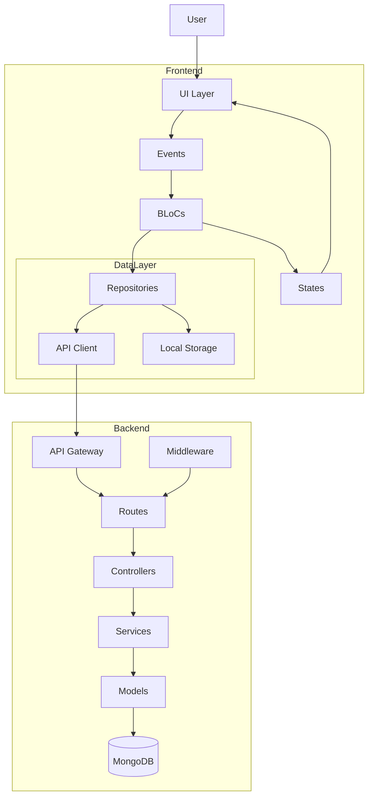

# ICY Application Architecture

## Overview

ICY is a cross-platform mobile application built with Flutter, following a BLoC (Business Logic Component) pattern architecture. The backend is built with Node.js and Express, using MongoDB as the database.

## Architecture Layers

### Frontend Architecture (Flutter)

The frontend follows a Clean Architecture approach with the following layers:

1. **Presentation Layer**
   - **Widgets**: UI components
   - **Screens**: Complete app screens composed of widgets
   - **Blocs**: Business Logic Components that manage state

2. **Domain Layer**
   - **Repositories**: Abstract class definitions for data operations
   - **Models**: Data models representing business entities

3. **Data Layer**
   - **Repository Implementations**: Concrete implementations of repositories
   - **Data Sources**: API clients, local storage, etc.
   - **DTOs**: Data Transfer Objects for serialization/deserialization

### State Management

The application uses the BLoC pattern with the following components:

- **Events**: Input events triggered by user interactions
- **States**: Output states representing UI states
- **BLoCs**: Components connecting events to states through business logic

### Backend Architecture (Node.js)

The backend follows an MVC-like pattern:

1. **Routes**: Define API endpoints
2. **Controllers**: Handle request processing and response generation
3. **Models**: MongoDB schema definitions and data models
4. **Services**: Business logic implementation
5. **Middleware**: Request preprocessing (authentication, validation, etc.)
6. **Utils**: Helper functions and utilities

## Data Flow

1. User interacts with the UI
2. UI dispatches an Event to the BLoC
3. BLoC processes the event and calls Repository methods
4. Repository communicates with API or local storage
5. API communicates with backend controllers
6. Controllers process requests using Models and Services
7. Response flows back to the UI through the same layers
8. UI updates based on new State from BLoC

## Architecture Diagram

## Key Technologies

### Frontend
- Flutter/Dart
- BLoC for state management
- HTTP package for API communication
- SharedPreferences for local storage
- JSON serialization

### Backend
- Node.js with Express
- MongoDB with Mongoose
- JWT for authentication
- bcrypt for password hashing
- Winston for logging

## Deployment Architecture

- Frontend: Built and deployed to iOS App Store and Google Play Store
- Backend: Deployed to cloud services (e.g., AWS, Azure, or GCP)
- Database: MongoDB Atlas (cloud-hosted MongoDB)

## Security Considerations

- JWT-based authentication
- Password hashing with bcrypt
- HTTPS for all API communications
- Input validation on both client and server
- Rate limiting on sensitive endpoints

## Performance Considerations

- API response caching
- Lazy loading for lists and images
- Pagination for large data sets
- Optimized database queries with proper indexing

## Scalability Considerations

- Stateless backend design for horizontal scaling
- Efficient database schema design
- CDN usage for static assets
