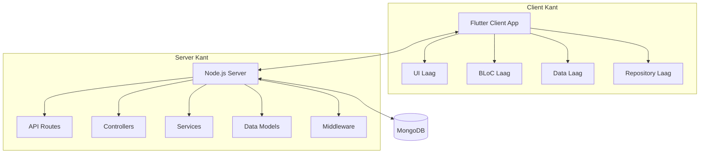
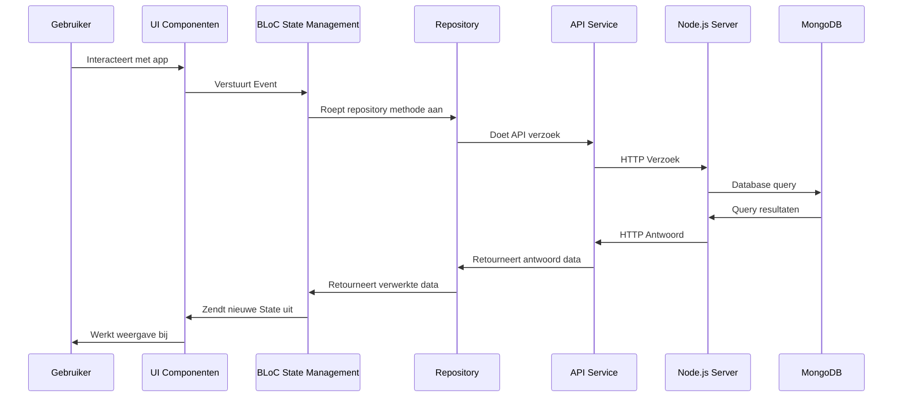
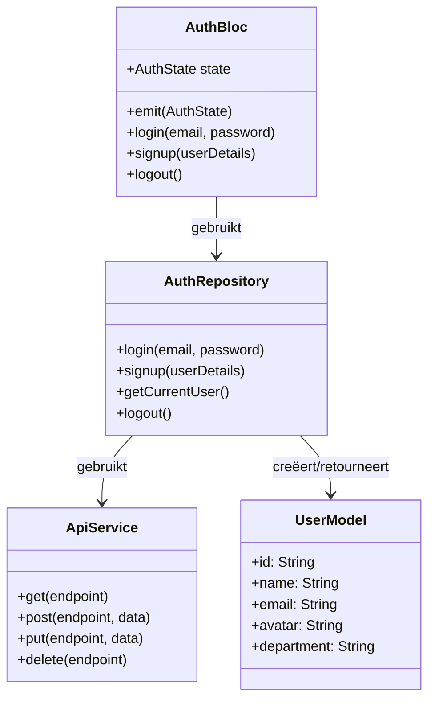
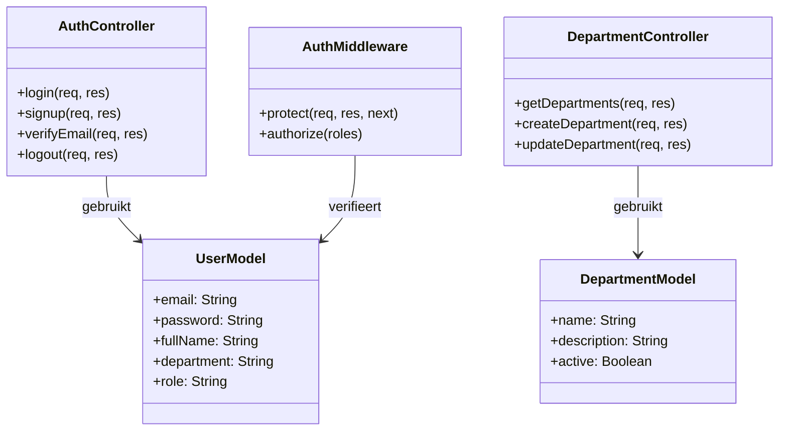

# ICY Applicatie Architectuur

## Overzicht

ICY is een cross-platform mobiele applicatie gebouwd met Flutter, volgens een BLoC (Business Logic Component) patroon architectuur. De backend is gebouwd met Node.js en Express, met MongoDB als database.

## Systeem Architectuur

### Architectuur op Hoog Niveau

### Client-Server Communicatie Stroom

## Architectuurlagen

### Frontend Architectuur (Flutter)

De frontend volgt een Clean Architecture aanpak met de volgende lagen:

1. **Presentatielaag**
   - **Widgets**: UI-componenten
   - **Screens**: Complete appschermen samengesteld uit widgets
   - **Blocs**: Business Logic Components die de state beheren

2. **Domeinlaag**
   - **Repositories**: Abstracte klassedefinities voor data-operaties
   - **Models**: Datamodellen die business-entiteiten vertegenwoordigen

3. **Datalaag**
   - **Repository Implementaties**: Concrete implementaties van repositories
   - **Data Sources**: API-clients, lokale opslag, etc.
   - **DTOs**: Data Transfer Objects voor serialisatie/deserialisatie

### State Management

De applicatie gebruikt het BLoC-patroon met de volgende componenten:

- **Events**: Input events getriggerd door gebruikersinteracties
- **States**: Output states die UI-statussen vertegenwoordigen
- **BLoCs**: Componenten die events met states verbinden via businesslogica

### Backend Architectuur (Node.js)

De backend volgt een MVC-achtig patroon:

1. **Routes**: Definiëren API-eindpunten
2. **Controllers**: Behandelen verzoekverwerking en responsegeneratie
3. **Models**: MongoDB-schemadefinities en datamodellen
4. **Services**: Businesslogica-implementatie
5. **Middleware**: Verzoekvoorverwerking (authenticatie, validatie, etc.)
6. **Utils**: Hulpfuncties en utilities

## Belangrijke Componenten en Hun Relaties

### Client Componenten

### Server Componenten

## Gegevensstroom

1. Gebruiker interacteert met de UI
2. UI verstuurt een Event naar de BLoC
3. BLoC verwerkt het event en roept Repository-methodes aan
4. Repository communiceert met API of lokale opslag
5. API communiceert met backend controllers
6. Controllers verwerken verzoeken met behulp van Models en Services
7. Respons stroomt terug naar de UI door dezelfde lagen
8. UI wordt bijgewerkt op basis van nieuwe State van BLoC

## API Eindpunten Overzicht

| Eindpunt | Methode | Beschrijving | Authenticatie |
|----------|---------|--------------|---------------|
| `/api/v1/auth/login` | POST | Gebruiker inloggen | Nee |
| `/api/v1/auth/register` | POST | Gebruiker registratie | Nee |
| `/api/v1/auth/verify-email` | POST | Email verificatie | Nee |
| `/api/v1/departments` | GET | Alle afdelingen ophalen | Nee |
| `/api/v1/departments/:id` | GET | Afdeling op ID ophalen | Nee |
| `/api/v1/departments` | POST | Afdeling aanmaken | Ja (Admin) |
| `/api/v1/surveys` | GET | Alle enquêtes ophalen | Ja |
| `/api/v1/achievements/badges` | GET | Alle badges ophalen | Ja |
| `/api/v1/marketplace/items` | GET | Marktplaats items ophalen | Ja |

## Belangrijke Technologieën

### Frontend
- Flutter/Dart
- BLoC voor state management
- HTTP package voor API-communicatie
- SharedPreferences voor lokale opslag
- JSON serialisatie

### Backend
- Node.js met Express
- MongoDB met Mongoose
- JWT voor authenticatie
- bcrypt voor wachtwoord hashing
- Winston voor logging

## Deployment Architectuur

- Frontend: Gebouwd en gedeployed naar iOS App Store en Google Play Store
- Backend: Gedeployed naar cloudservices (bijv. AWS, Azure, of GCP)
- Database: MongoDB Atlas (cloud-hosted MongoDB)

## Beveiligingsoverwegingen

- JWT-gebaseerde authenticatie
- Wachtwoord hashing met bcrypt
- HTTPS voor alle API-communicaties
- Invoervalidatie op zowel client als server
- Rate limiting op gevoelige eindpunten

## Prestatieoverwegingen

- API-respons caching
- Lazy loading voor lijsten en afbeeldingen
- Paginering voor grote datasets
- Geoptimaliseerde database queries met indexering

## Schaalbaarheidsoverwegingen

- Stateless backend design voor horizontale schaling
- Efficiënt database schema-ontwerp
- CDN gebruik voor statische assets
