# ICY Applicatie Gebruiksscenario's

## Primaire Actoren

1. **Gewone Gebruiker**: Reguliere medewerkers die de ICY app gebruiken
2. **Teamleider**: Afdelingshoofden, kunnen teamprestaties inzien
3. **Beheerder**: Kan alle systeemaspecten beheren

## Gebruiksscenario's

### Authenticatie & Gebruikersbeheer
- Inloggen in de applicatie
- Nieuwe account registreren
- Wachtwoord herstellen
- Gebruikersprofiel bijwerken
- Persoonlijke gegevens bekijken en bewerken

### Enquête Functionaliteit
- Beschikbare enquêtes bekijken
- Dagelijkse enquêtes invullen
- Enquêtevoortgang opslaan
- Enquêteantwoorden indienen
- Enquêtegeschiedenis bekijken

### Prestaties & Beloningen
- Verdiende badges en prestaties bekijken
- Voortgang van prestaties bijhouden
- Actieve uitdagingen bekijken
- Uitdagingen voltooien voor beloningen
- XP verdienen en niveau verhogen

### Marktplaats
- Marktplaatsitems bekijken
- Itemcategorieën bekijken
- Beloningen kopen met verdiende munten
- Aankoopgeschiedenis bekijken
- Gekochte items inwisselen

### Teamsamenwerking
- Teamleden bekijken
- Teamstatistieken bekijken
- Teamranking bijhouden
- Ranglijsten bekijken
- Afdelingsvoortgang bijhouden

### Notificaties
- Notificaties ontvangen
- Notificatiegeschiedenis bekijken
- Notificaties als gelezen markeren
- Reageren op actienotificaties

### Administratie
- Gebruikers beheren
- Enquêtes aanmaken en beheren
- Badges en uitdagingen configureren
- Marktplaatsitems beheren
- Systeemanalyses bekijken

## Gebruiksscenario Relaties

- Gewone Gebruiker: Kan alle basisfuncties van de app gebruiken
- Teamleider: Heeft rechten van Gewone Gebruiker plus teambeheerfuncties
- Beheerder: Heeft alle rechten en systeembeheermogelijkheden

## UML Gebruiksscenario Diagram

```mermaid
flowchart TD
    User["Gewone Gebruiker"]
    TeamLead["Teamleider"]
    Admin["Beheerder"]
    
    %% Authenticatie Gebruiksscenario's
    Auth[Authenticatie]
    Login[Inloggen]
    Register[Registreren]
    ResetPwd[Wachtwoord Herstellen]
    Profile[Profiel Beheren]
    
    %% Enquête Gebruiksscenario's
    Surveys[Enquêtes]
    ViewSurveys[Enquêtes Bekijken]
    CompleteSurveys[Enquêtes Invullen]
    ViewHistory[Geschiedenis Bekijken]
    
    %% Prestaties Gebruiksscenario's
    Achieve[Prestaties]
    ViewBadges[Badges Bekijken]
    Challenges[Uitdagingen Voltooien]
    TrackProgress[Voortgang Bijhouden]
    
    %% Marktplaats Gebruiksscenario's
    Market[Marktplaats]
    BrowseItems[Items Bekijken]
    Purchase[Items Kopen]
    Redeem[Beloningen Inwisselen]
    
    %% Team Gebruiksscenario's
    Team[Teambeheer]
    ViewTeam[Team Bekijken]
    TeamStats[Teamstatistieken]
    Leaderboard[Ranglijst]
    
    %% Notificaties Gebruiksscenario's
    Notify[Notificaties]
    ReceiveNotify[Notificaties Ontvangen]
    ManageNotify[Notificaties Beheren]
    
    %% Beheerder Gebruiksscenario's
    AdminFunc[Administratie]
    ManageUsers[Gebruikers Beheren]
    ManageSurveys[Enquêtes Beheren]
    ManageBadges[Prestaties Beheren]
    SystemAnalytics[Systeemanalyse]
    
    %% Relaties
    User --> Auth
    User --> Surveys
    User --> Achieve
    User --> Market
    User --> Team
    User --> Notify
    
    TeamLead --> User
    TeamLead --> Team
    
    Admin --> TeamLead
    Admin --> AdminFunc
    
    %% Gedetailleerde relaties
    Auth --> Login
    Auth --> Register
    Auth --> ResetPwd
    Auth --> Profile
    
    Surveys --> ViewSurveys
    Surveys --> CompleteSurveys
    Surveys --> ViewHistory
    
    Achieve --> ViewBadges
    Achieve --> Challenges
    Achieve --> TrackProgress
    
    Market --> BrowseItems
    Market --> Purchase
    Market --> Redeem
    
    Team --> ViewTeam
    Team --> TeamStats
    Team --> Leaderboard
    
    Notify --> ReceiveNotify
    Notify --> ManageNotify
    
    AdminFunc --> ManageUsers
    AdminFunc --> ManageSurveys
    AdminFunc --> ManageBadges
    AdminFunc --> SystemAnalytics
```

